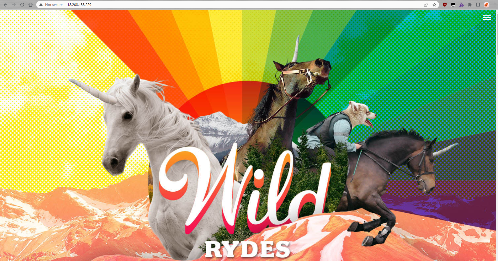

# Capstone 2

## Project Workflow

### Web Application Update

I made two changes to the main index.html page. I changed the title from "Full Stack Academy" to "Wyld Rides" and a section title from "Sign Up" to "Ride with Us!"

### Version Control and Code Management

After cloning the repository to my local machine from Jamal's github I then removed the original origin. I then set the origin to a newly created repository under my own GitHub account and push all the project files up to that repository.


### Containerization

I created a [dockerfile](Dockerfile) containing instructions on how to build an image using this codebase and a standard nginx image from dockerhub. I first ran this image locally, observing that it worked correctly and that the website was loading properly before I added and pushed the dockerfile to my repository.

``` docker
#Using the official Nginx base image
FROM nginx
#Copy website code to the container
COPY . /usr/share/nginx/html
#Expose port 80
EXPOSE 80
#Start Nginx at container launch
CMD ["nginx", "-g", "daemon off;"]
```
### Cloud Deployment

Deploy the containerized application to a new ec2 instance.

1. Provision an ec2 named console-ec2

2. Make sure that SSH is accessible

3. Install git and docker on the ec2.

4. Clone the repository to the ec2.

5. Build and run the docker image.

6. In a browser, enter the public IP of the ec2 instance and verify that the site is accessible.


### Deployment with CloudFormation

Deploy the containerized application to an ec2 provisioned by CloudFormation.

1. Copy and fix the indentation of the template to a new [file](IAC/infrastructure.yaml) in the repository.
2. Add SSH access to SecurityIngressIngress
   
``` yaml
- IpProtocol: tcp
   FromPort: 22
   ToPort: 22
   CidrIp: 0.0.0.0/0
```
3. Upload the template to CloudFormation and follow the steps in the wizard.


4. SSH into the newly created instance and clone the repository.
5. Build and run the docker image.

6. In a browser, enter the public IP of the ec2 instance and verify that the site is accessible.


## Key Takeaways

Docker is a powerful tool for containerizing and running applications on a variety of platforms. This capstone showed that this can be accomplish both manually and using a CloudFormation template to provision an appropriate ec2 server and associated security group. Also, this capstone demonstrated the power of having a git repository to push updates to and from which to pull code and updates and deploying it to multiple locations.